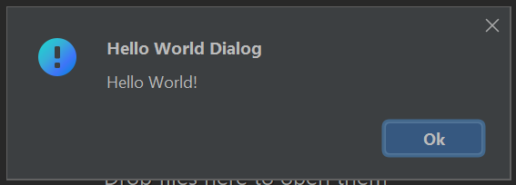

# KTHelloWorldPlugin

## Installation
Here are steps you need to follow in order to install this plugin:
- Clone this repository
- Build the project using Gradle
- In IntelliJ go to `Settings` -> `Plugins`
- Click on three dots symbol -> `Install Plugin from Disk...`

    

- In a path field enter: `${project_path}/build/libs/KTHelloWorldPlugin-1.0-SNAPSHOT.jar`, where `${project_path}` is a path to a directory to which you have cloned the repository into
- Click `OK`.

Plugin should be successfully installed by now.

## Usage
To use this plugin you should open `Search Everywhere` (by default it's **double-shift** shortcut). Then you should look for `Hello World` action and choose it.

The Hello World Dialog should open and you should see something like this:

When you are done with greeting the World you can click "Ok", which closes the dialog. Feel free to use it as many times a day as you like :).
